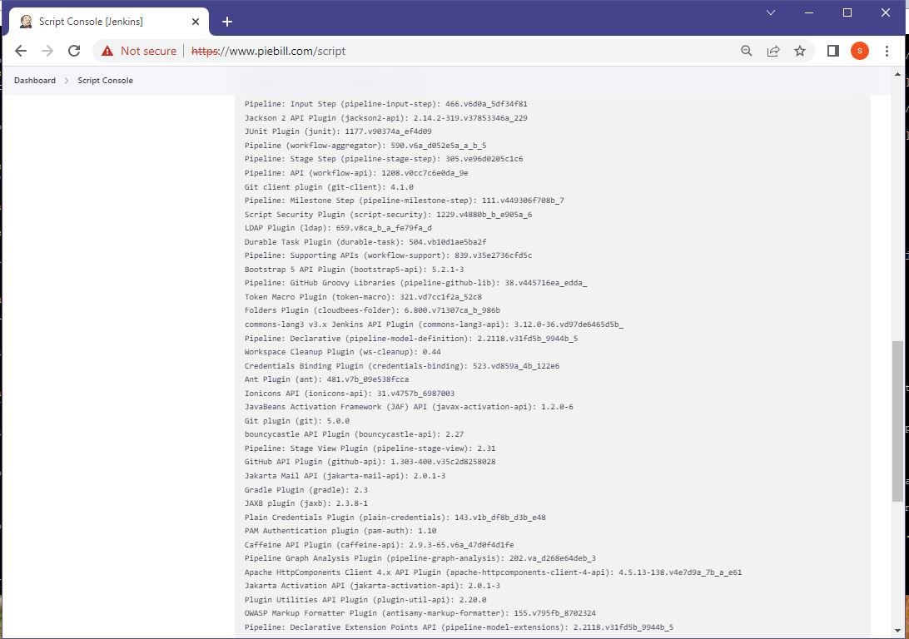

# Setup Jenkins with NGINX as Reverse Proxy and SSL Certificates. Jenkins Automation with default plugins and Login Credentials in Docker containers.
--

#### Create t2.medium, Ubuntu 22.04 AWS EC2 Instance
#### Allow 80, 443 in Security Groups Inbound Traffic Rules

#### Run below commands to update keytool command
```
sudo apt update && sudo apt upgrade && sudo apt install openjdk-11-jdk
```

#### Run below command to install docker and "docker compose" software:
```
chmod 755 ec2software.sh
./ec2software.sh
```

#### Run below script to get plugins.txt file from https://jenkins.piebill.com/script
#### Get list of installed Jenkins Plugins using jenkins-cli
#### Goto https://jenkins.piebill.com/script paste below script in box and click "Run"
```
Jenkins.instance.pluginManager.plugins.each{
  plugin ->
    println ("${plugin.getDisplayName()} (${plugin.getShortName()}): ${plugin.getVersion()}")
}
```

#### Get list of installed Jenkins Plugins using jenkins-cli from https://jenkins.piebill.com/cli
#### and click the "download jenkins-cli.jar" link
#### OR
#### Use below commands to download and execute with java
```
sudo apt update && sudo apt upgrade && sudo apt install openjdk-11-jdk
wget https://jenkins.piebill.com/jnlpJars/jenkins-cli.jar
java -jar jenkins-cli.jar -s Jenkins_URL list-plugins > plugins.txt
OR
java -jar ./jenkins-cli.jar -s "$JENKINS_URL" -auth $JENKINS_ADMIN_USER:$JENKINS_ADMIN_PASSWD -noKeyAuth list-plugins
```

#### Update the nginx/default.conf and Replace ALL jenkins.piebill.com url with your URL e.g. jenkins.yoursite.com

#### Run below commands to start Jenkins and NGINX containers:
```
docker compose pull
docker compose build
docker compose up -d
```

#### Run below command to get the IP Address of EC2:
```
wget -qO- http://instance-data/latest/meta-data/public-ipv4; echo
```

#### Update your DNS Records in your hosting provider Dashboard ref Image 1.


#### Open browser at URL: https://ip-address:443 or https://jenkins.yoursite.com:443
#### Login with Credentials with admin and Admin@123 as set in jenkins/Dockerfile


**Refernce Images below:**
---

#### 1. Updating DNS Entries in your Hosting Provider CPanel


#### 2. Accepting HTTPS Un-Verified Secure Tokens


#### 3. HTTPS/SSL Secure Login with Credentials as per Dockerfile  JENKINS_USER=admin and  JENKINS_PASS=Admin@123


#### 4. Jenkins Client Download page


#### 5. Jenkins Script Execution Page for listing Jenkins install Plugins


#### 6. Jenkins Plugins List Page 2


#### 7. Jenkins Plugins List Page 3



#### 8. Jenkins Plugins List Page 4


---

#### Notes: Use below command to clean up all Docker images, contiainers, networks and system files
```
docker ps -a ; docker stop $(docker ps -qa) ; docker images ls -a ; docker container ls -la ; docker volume ls ; docker container ls -la | awk '{print $1}' | grep -v "CONTAINER" | xargs docker container rm  ; docker images -a | awk '{print $3}' | grep -v "IMAGE" | xargs docker image remove ; docker container ls -la ; docker images -a ; docker volume rm $(docker volume ls -q) ;  docker image prune -af ; docker container prune -af ; docker volume prune -af ; docker system prune -af ; docker ps -a ; docker images ls -a ; docker container ls -la ; docker volume ls
```


#### .netrc for git pushing
```
$ cat ~/.netrc
machine github.com
        login wrkbase
        password GHPkgBDssFYHaILmDgcUj6saq8zvYKF2LpHc4
```

#### Install dive to view offline Docker Image contents:
```
wget https://github.com/wagoodman/dive/releases/download/v0.9.2/dive_0.9.2_linux_amd64.deb
sudo apt install ./dive_0.9.2_linux_amd64.deb
```

#### Install net-tools for sudo netstat -plnt command
```
sudo apt install net-tools
```

#### To pull git repo
```
git clone https://github.com/wrkbase/jenkinsplugins-dckr-ssl.git
```

#### To push to git repo
```
git add . && git commit -m "Updating latest docs and code" && git push origin
```


#### To view git modifications status
```
git status
```

#### To view git pushed status to origin
```
git log --name-status
```

#### To revert to previous commit state
```
git reset --hard HEAD~1
git log --name-status
git push -f -u origin
OR
git push -f -u origin main
```

**Setting up bash script for alias commands** 

ubuntu:~$ cat shcut.sh

```
alias cls='clear'
alias scn='screen'
alias gitusr='git config --global user.name "Srikanth Pen"'
alias giteml='git config --global user.email "wrkbase@gmail.com"'
alias gitlst='git config --list --global'
alias gtcl='git clone https://bitbucket.org/wrkbase/dockertraefikselfsign.git --branch master'
alias frgrp='for i in `find src -name "*.js"`; do echo $i ===========================; grep "createUser" $i; done'
alias frdif='for i in `find . -name "*.ORG"`; do echo $i =====================================; fl=`echo $i | sed 's/.ORG$//'`; diff --color $i $fl; done'
alias diffc='diff --color'
alias gits='git status'
alias gitns='git log --name-status'
alias gitdc='git log --graph --all --decorate --pretty="%Cred%h%Creset -%C(auto)%d%Creset %s %Cgreen(%ad) %C(bold blue)<%an>%Creset" --date=short'
alias gitcomm='git status; git checkout -b main; git add . && git commit -m "Updating latest docs and code" && git push origin; git status;'
alias gitfrc='git push -f -u origin master'
```

---
